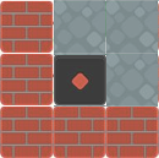

# Chinese-Sokoban
=======
# Dynasty Maze: The Emperor's Escape

## About
"Dynasty Maze: The Emperor's Escape" combines the strategic depth of
Sokoban with the historical intrigue of Huarong Dao, offering a unique
puzzle experience set in an ancient Chinese
dynasty. 

## How to Play
In this game, players control a main character navigating through various levels, each with its own set of challenges and puzzles reminiscent of the classic Sokoban game. The primary objective is to push boxes to designated target points on the map to progress through levels.

As you advance, the game introduces new elements and challenges to test your puzzle-solving abilities. From Level 3 onwards, a second character comes into play, adding an extra layer of strategy as you'll need to maneuver both the main character and this new character to their respective targets.

Successfully completing all target points within a level triggers the game to automatically advance to the next level after a brief 2-second interval. Should you find yourself in a situation where completion becomes impossible, or if you wish to retry the level for any reason, you have the option to restart the current level.

### Controls
- Arrow Keys: Move the player in the desired direction. Use the up, down, left, and right arrows to navigate the game area.
- R Key: Restart the current level. Use this control if you need to reset the level's puzzles 
- Special Note:
From Level 3, you'll encounter a second character. Control this character by first moving adjacent to them. Once close, your movements will also influence their position, allowing you to guide them to their target alongside managing the main character and the boxes.

## How to Install/Run
1. Download the Game Package:
Click on zip to download the game package. This package includes the game's executable file, source code, and this README for your reference.

2. Extract the Downloaded ZIP File:
Locate the downloaded ZIP file on your computer. It should be named something like MazeDynasity.zip.
Right-click on the ZIP file and select "Extract All..." or "Unzip" (the exact option may vary depending on your operating system). Choose a destination where you want the extracted folder to go and confirm the action.
After extraction, open the newly created folder that contains the game's files.
3. Run the Game:
In the extracted folder, find the executable file named MazeDynasity.app 
Double-click on the executable file to start the game. Depending on your operating system's security settings, you may need to confirm that you trust the file before it will run.

## System Requirements
System Requirements
To ensure a smooth gaming experience, please review the minimum and recommended system requirements below for macOS before installing and running the game.

### Minimum Requirements
Operating System: macOS 10.12 Sierra or later
Processor: Intel Core i5 2.5 GHz or equivalent
Memory: 4 GB RAM
Graphics: Intel HD Graphics 4000 or better
Storage: 2 GB available space
### Recommended Requirements
Operating System: macOS 10.15 Catalina or later
Processor: Intel Core i7 3.0 GHz or equivalent
Memory: 8 GB RAM
Graphics: AMD Radeon R9 M395X or better
Storage: 2 GB of available space
### Additional Notes:
If you would like to run the game through Unity Hub using the source file, it will require Unity 2022.3.20f1

## Credits
- 熊猫办公. (n.d.). Q版三国人物图片素材 [Q-version Three Kingdoms character image materials]. Retrieved March 5, 2024, from 

Image sourced from [Graphite Unity Sokoban project](https://github.com/peteschmitz/Graphite.Unity.Sokoban) by Pete Schmitz.

- 熊猫办公. (n.d.). Q版三国人物图片素材 [Q-version Three Kingdoms character image materials]. Retrieved [Date of Access], from https://www.tukuppt.com/sopng/qbansanguorenwu.html

